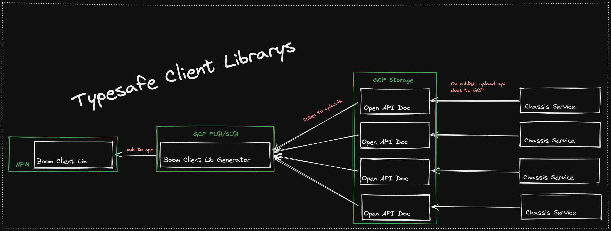

# Fetcher

</img>

> Create typesafe, un-opinionated, client SDK's for your existing OpenAPI 3.0.0 compliant API's.

## About

W.I.P! Missing a whole bunch of stuff like ability to deal with typed headers.

This program generates client code which handles making network calls to our boom services using your existing client http solution. Writing, and maintaining network calls is a pain. Wether its the backend puts out a new api you need to utilize, or they update a response object, you now have to basically copy their work into your client codebase. There is little thought that goes into these functions most of the time. Most of the time you will look at the endpoint, request schema, and response schema, and implement a basic function wrapping it all up for use across your client. Why not just generate those functions?

## When To Reach For Fetcher

- You have a OpenAPI 3.0.0 compliant API
- You have multiple clients which will utilize the same API
- Your API Updates frequently

## How to use

This section is living, and highly likely to change, but as of now, here is how to use this library.

### Generating Client Libraries

1. Have the open api schema json file you wish to generate from locally installed.
2. Have this repo installed, built, and running.
3. Call `node ./build/src/index.js generate {{PATH_TO_YOUR_SCHEMA}} {{DESTINATION_FOR_LIB}}`

### Using Generated Client Libraries

1. Generate your client library
2. Move the library into your project (either through node_modules, or just copy and pasting).
3. Import the setup function from the library
4. Pass your adapter to the setup function, in return for your initialized client library

### Example of initializing a client library, and calling a network call

```ts
const adapter: ServiceCallAdapter = async function(
  url: string,
  method: HTTPMethod,
  body: unknown,
) {
  const res = await axiosInstance({
    method: method,
    url: url,
    data: body ? body : null,
  });
  return {
    data: res.data,
    statusCode: res.status,
  };
};

const DogsSDK = createDogSDK(adapter);

DogsSDK.getBreeds(
  {
    query: {
      pageCount: 10,
      page: 2,
    },
  },
  {
    '200': (response) => {
      setBreeds(response.breeds);
    },
    '500': (response) => {
      alert(response.code);
    },
    fallback: (response: any) => {
      console.log('Server responded with unexpected status code', response);
    },
  },
);
```

## Why use an adapter instead of handling that internally within the library?

Utilizing adapters allows for us to stay un-opinionated. Another pro of using adapters is that by moving the actual network call execution out of our libraries and back into the hands of the developers, our libraries are very simple functions which basically just provide typesaftey, and function arguments to your actual networking solution. They do not perform any logic. We aren't here to architect your applications networking solution for you, we just want to make it easier to build. Since our SDK's are just simple functions, You can easily move on, or off of our solution.

## Why Does This Exist

- Writing network calls sucks
- Writing typed network calls sucks even more
- The backend already wrote all the types and such, lets just use it.
- Fullstack Typesaftey lets us move quickly.
- Fullstack Typesaftey lets us catch bugs before they happen.

## Deployed Diagram

Below is a diagram of how you could deploy this application to automatically generate new Client Lib's whenever a backend service is deployed. This application is the "Boom Client Lib Generator"



## Tech Used

- Handlebars
- Mocha
- Chai
- OpenApi 3.0.0 Specification
- Typescript
- Node

### Development

#### Scripts

- `yarn build` - Build the application
- `yarn dev` - Runs the cli, generating an api lib
- `yarn test` - Run tests
- `yarn clean` - Clean the project

#### Tips

- `todo.md` in the root dir is git ignored if you need a scratch pad

## Open API Spec

https://github.com/OAI/OpenAPI-Specification/blob/main/versions/3.0.0.md

## Notes

We should only type types once if they are provided in the "components" section of the schema.
This way we can also provide more semantic names (assuming the schemas names for components are semantic).

If we could extend the OpenAPI 3.0.0 schema to include things like "invalidates" and "cacheSettings" on operations, we could easily also generate Tanstack Query hooks for all of our network calls as well. Which would be insaneeeeeeeeeeeee. Literally all you would write is UI

Does the backend have tests for their endpoints? If so we could easily test our generated api's by matching their responses.

Alot of the backend schemas are out of date / wrong

## Example output

```ts
/*
 *       ___
 *    __/_  `.  .-"""-.
 *    \_,` | \-'  /   )`-')
 *      "") `"`    \  ((`"`
 *     ___Y  ,    .'7 /|
 *    (_,___/...-` (_/_/      FETCHER
 *
 *  Yo this file is auto generated, no touchy.
 */

/* eslint-disable max-lines */
/* eslint-disable sort-keys */

export type ResponseType<
  Func extends (argA: any, argB: Record<string, any>) => any,
  StatusCode extends keyof Parameters<Func>[1]
> = Parameters<Parameters<Func>[1][StatusCode]>[0];

export type HTTPMethod = "get" | "post" | "put" | "patch" | "update" | "delete";

export type ServiceCallResponse<Response> = {
  data: Response;
  statusCode: number;
};

export type ServiceCallAdapter = <Response>(
  url: string,
  method: HTTPMethod,
  body?: unknown
) => Promise<ServiceCallResponse<Response>>;

let adapter: ServiceCallAdapter | null = null;

const initializeFetcherWarning =
  "Please initialize Fetcher before attempting to make any network calls";
const unexpectedErrorWarning = "Unexpected error occurred";

/**
 * @description
 */
const BoomSportsUserService = {
  /**
   * @description Migrate a user from old boom (meteor) to the new DFS product.
   */
  migrateUser: async (
    request: {
      body: {
        _id: string;
        createdAt: string;
        username: string;
        email?: { address: string; verified: boolean };
        balance: number;
        marketingConsent: boolean;
        password?: string;
        phone?: string;
        deposited?: boolean;
        enteredPaidContest?: boolean;
        totalDeposited?: number;
        experience?: number;
      };
    },
    callbacks: Record<number, any> & {
      200?: (response: string) => void;
      500?: (response: {
        code?: string;
        id?: string;
        message?: string;
        details?: string;
      }) => void;
      fallback?: (response?: unknown) => void;
    }
  ) => {
    const finalURL =
      "https://development-api.boomfantasy.com:443/api/v1/users/migrate";
    if (!adapter) {
      throw new Error(initializeFetcherWarning);
    }
    let response;
    try {
      response = await adapter(finalURL, "post", request.body);
    } catch (err: any) {
      response = err.response;
    }
    if (callbacks[response.statusCode]) {
      callbacks[response.statusCode](response.data);
      return;
    }
    if (!callbacks.fallback) {
      throw new Error(unexpectedErrorWarning);
    }
    callbacks.fallback(response.data);
  },
  /**
   * @description Create invites in bulk by uploading a csv file with correct information
   */
  bulkCreateInvitesV1: async (
    request: null,
    callbacks: Record<number, any> & {
      500?: (response: {
        code?: string;
        id?: string;
        message?: string;
        details?: string;
      }) => void;
      fallback?: (response?: unknown) => void;
    }
  ) => {
    const finalURL =
      "https://development-api.boomfantasy.com:443/api/v1/users/invites/bulkCreate";
    if (!adapter) {
      throw new Error(initializeFetcherWarning);
    }
    let response;
    try {
      response = await adapter(finalURL, "post");
    } catch (err: any) {
      response = err.response;
    }
    if (callbacks[response.statusCode]) {
      callbacks[response.statusCode](response.data);
      return;
    }
    if (!callbacks.fallback) {
      throw new Error(unexpectedErrorWarning);
    }
    callbacks.fallback(response.data);
  },
  /**
   * @description Create invites in bulk by uploading a csv file with correct information
   */
  bulkCreateInvitesV2: async (
    request: null,
    callbacks: Record<number, any> & {
      500?: (response: {
        code?: string;
        id?: string;
        message?: string;
        details?: string;
      }) => void;
      fallback?: (response?: unknown) => void;
    }
  ) => {
    const finalURL =
      "https://development-api.boomfantasy.com:443/api/v2/users/invites/bulkCreate";
    if (!adapter) {
      throw new Error(initializeFetcherWarning);
    }
    let response;
    try {
      response = await adapter(finalURL, "post");
    } catch (err: any) {
      response = err.response;
    }
    if (callbacks[response.statusCode]) {
      callbacks[response.statusCode](response.data);
      return;
    }
    if (!callbacks.fallback) {
      throw new Error(unexpectedErrorWarning);
    }
    callbacks.fallback(response.data);
  },
  /**
   * @description Get invites.
   */
  getInvitesV1: async (
    request: {
      query: {
        groupId?: string;
        type?: "celebrity" | "plebian" | "public";
      };
    },
    callbacks: Record<number, any> & {
      200?: (
        response: Array<{
          type: "celebrity" | "plebian" | "public";
          emailAddress?: string;
          username?: string;
          groupId?: string;
          code?: string;
          maxAcceptance?: number;
          expirationDate?: string;
        }>
      ) => void;
      500?: (response: {
        code?: string;
        id?: string;
        message?: string;
        details?: string;
      }) => void;
      fallback?: (response?: unknown) => void;
    }
  ) => {
    let finalURL =
      "https://development-api.boomfantasy.com:443/api/v1/users/invites";
    finalURL += `?${Object.entries(request.query)
      .map(([key, value]) => `${key}=${value}`)
      .join("&")}`;
    if (!adapter) {
      throw new Error(initializeFetcherWarning);
    }
    let response;
    try {
      response = await adapter(finalURL, "get");
    } catch (err: any) {
      response = err.response;
    }
    if (callbacks[response.statusCode]) {
      callbacks[response.statusCode](response.data);
      return;
    }
    if (!callbacks.fallback) {
      throw new Error(unexpectedErrorWarning);
    }
    callbacks.fallback(response.data);
  },
  /**
   * @description Create an invitation to allow people to join the app and/or groups
   */
  createInviteV1: async (
    request: {
      body: {
        type: "celebrity" | "plebian" | "public";
        emailAddress?: string;
        username?: string;
        groupId?: string;
        code?: string;
        maxAcceptance?: number;
        expirationDate?: string;
      };
    },
    callbacks: Record<number, any> & {
      200?: (response: {
        inviteId?: string;
        branchLink?: string;
        code?: string;
      }) => void;
      500?: (response: {
        code?: string;
        id?: string;
        message?: string;
        details?: string;
      }) => void;
      fallback?: (response?: unknown) => void;
    }
  ) => {
    const finalURL =
      "https://development-api.boomfantasy.com:443/api/v1/users/invites";
    if (!adapter) {
      throw new Error(initializeFetcherWarning);
    }
    let response;
    try {
      response = await adapter(finalURL, "post", request.body);
    } catch (err: any) {
      response = err.response;
    }
    if (callbacks[response.statusCode]) {
      callbacks[response.statusCode](response.data);
      return;
    }
    if (!callbacks.fallback) {
      throw new Error(unexpectedErrorWarning);
    }
    callbacks.fallback(response.data);
  },
  /**
   * @description Get invites.
   */
  getInvitesV2: async (
    request: {
      query: {
        groupId?: string;
        type?: "celebrity" | "plebian" | "public";
      };
    },
    callbacks: Record<number, any> & {
      200?: (
        response: Array<{
          type: "celebrity" | "plebian" | "public";
          emailAddress?: string;
          username?: string;
          groupId?: string;
          code?: string;
          maxAcceptance?: number;
          expirationDate?: string;
        }>
      ) => void;
      500?: (response: {
        code?: string;
        id?: string;
        message?: string;
        details?: string;
      }) => void;
      fallback?: (response?: unknown) => void;
    }
  ) => {
    let finalURL =
      "https://development-api.boomfantasy.com:443/api/v2/users/invites";
    finalURL += `?${Object.entries(request.query)
      .map(([key, value]) => `${key}=${value}`)
      .join("&")}`;
    if (!adapter) {
      throw new Error(initializeFetcherWarning);
    }
    let response;
    try {
      response = await adapter(finalURL, "get");
    } catch (err: any) {
      response = err.response;
    }
    if (callbacks[response.statusCode]) {
      callbacks[response.statusCode](response.data);
      return;
    }
    if (!callbacks.fallback) {
      throw new Error(unexpectedErrorWarning);
    }
    callbacks.fallback(response.data);
  },
  /**
   * @description Create an invitation to allow people to join the app and/or groups
   */
  createInvite: async (
    request: {
      body: {
        type: "celebrity" | "plebian" | "public";
        emailAddress?: string;
        username?: string;
        groupId?: string;
        code?: string;
        maxAcceptance?: number;
        expirationDate?: string;
      };
    },
    callbacks: Record<number, any> & {
      200?: (response: {
        inviteId?: string;
        branchLink?: string;
        code?: string;
      }) => void;
      500?: (response: {
        code?: string;
        id?: string;
        message?: string;
        details?: string;
      }) => void;
      fallback?: (response?: unknown) => void;
    }
  ) => {
    const finalURL =
      "https://development-api.boomfantasy.com:443/api/v2/users/invites";
    if (!adapter) {
      throw new Error(initializeFetcherWarning);
    }
    let response;
    try {
      response = await adapter(finalURL, "post", request.body);
    } catch (err: any) {
      response = err.response;
    }
    if (callbacks[response.statusCode]) {
      callbacks[response.statusCode](response.data);
      return;
    }
    if (!callbacks.fallback) {
      throw new Error(unexpectedErrorWarning);
    }
    callbacks.fallback(response.data);
  },
  /**
   * @description Get an invite.
   */
  getInviteV1: async (
    request: {
      params: {
        inviteId?: string;
      };
    },
    callbacks: Record<number, any> & {
      200?: (response: {
        _id?: string;
        type?: "celebrity" | "plebian" | "public";
        groupId?: string;
        code?: string;
        details?: {
          emailAddress?: string;
          username?: string;
          viewed?: boolean;
          used?: boolean;
        };
      }) => void;
      500?: (response: {
        code?: string;
        id?: string;
        message?: string;
        details?: string;
      }) => void;
      fallback?: (response?: unknown) => void;
    }
  ) => {
    let finalURL =
      "https://development-api.boomfantasy.com:443/api/v1/users/invites/:inviteId";
    Object.entries(request.params).forEach(([key, value]) => {
      finalURL = finalURL.replaceAll(`:${key}`, value);
      finalURL = finalURL.replaceAll(`{${key}}`, value);
    });
    if (!adapter) {
      throw new Error(initializeFetcherWarning);
    }
    let response;
    try {
      response = await adapter(finalURL, "get");
    } catch (err: any) {
      response = err.response;
    }
    if (callbacks[response.statusCode]) {
      callbacks[response.statusCode](response.data);
      return;
    }
    if (!callbacks.fallback) {
      throw new Error(unexpectedErrorWarning);
    }
    callbacks.fallback(response.data);
  },
  /**
   * @description Get an invite.
   */
  getInviteV2: async (
    request: {
      params: {
        inviteId?: string;
      };
    },
    callbacks: Record<number, any> & {
      200?: (response: {
        _id?: string;
        type?: "celebrity" | "plebian" | "public";
        groupId?: string;
        code?: string;
        details?: {
          emailAddress?: string;
          username?: string;
          viewed?: boolean;
          used?: boolean;
        };
      }) => void;
      500?: (response: {
        code?: string;
        id?: string;
        message?: string;
        details?: string;
      }) => void;
      fallback?: (response?: unknown) => void;
    }
  ) => {
    let finalURL =
      "https://development-api.boomfantasy.com:443/api/v2/users/invites/:inviteId";
    Object.entries(request.params).forEach(([key, value]) => {
      finalURL = finalURL.replaceAll(`:${key}`, value);
      finalURL = finalURL.replaceAll(`{${key}}`, value);
    });
    if (!adapter) {
      throw new Error(initializeFetcherWarning);
    }
    let response;
    try {
      response = await adapter(finalURL, "get");
    } catch (err: any) {
      response = err.response;
    }
    if (callbacks[response.statusCode]) {
      callbacks[response.statusCode](response.data);
      return;
    }
    if (!callbacks.fallback) {
      throw new Error(unexpectedErrorWarning);
    }
    callbacks.fallback(response.data);
  },
  /**
   * @description Accept a public or private invite
   */
  acceptInviteV1: async (
    request: {
      body: { inviteId?: string; code?: string };
    },
    callbacks: Record<number, any> & {
      200?: (response: {
        type: "celebrity" | "plebian" | "public";
        emailAddress?: string;
        username?: string;
        groupId?: string;
        code?: string;
        maxAcceptance?: number;
        expirationDate?: string;
      }) => void;
      500?: (response: {
        code?: string;
        id?: string;
        message?: string;
        details?: string;
      }) => void;
      fallback?: (response?: unknown) => void;
    }
  ) => {
    const finalURL =
      "https://development-api.boomfantasy.com:443/api/v1/users/invites/accept";
    if (!adapter) {
      throw new Error(initializeFetcherWarning);
    }
    let response;
    try {
      response = await adapter(finalURL, "post", request.body);
    } catch (err: any) {
      response = err.response;
    }
    if (callbacks[response.statusCode]) {
      callbacks[response.statusCode](response.data);
      return;
    }
    if (!callbacks.fallback) {
      throw new Error(unexpectedErrorWarning);
    }
    callbacks.fallback(response.data);
  },
  /**
   * @description Accept a public or private invite
   */
  acceptInviteV2: async (
    request: {
      body: { inviteId?: string; code?: string };
    },
    callbacks: Record<number, any> & {
      200?: (response: {
        type: "celebrity" | "plebian" | "public";
        emailAddress?: string;
        username?: string;
        groupId?: string;
        code?: string;
        maxAcceptance?: number;
        expirationDate?: string;
      }) => void;
      500?: (response: {
        code?: string;
        id?: string;
        message?: string;
        details?: string;
      }) => void;
      fallback?: (response?: unknown) => void;
    }
  ) => {
    const finalURL =
      "https://development-api.boomfantasy.com:443/api/v2/users/invites/accept";
    if (!adapter) {
      throw new Error(initializeFetcherWarning);
    }
    let response;
    try {
      response = await adapter(finalURL, "post", request.body);
    } catch (err: any) {
      response = err.response;
    }
    if (callbacks[response.statusCode]) {
      callbacks[response.statusCode](response.data);
      return;
    }
    if (!callbacks.fallback) {
      throw new Error(unexpectedErrorWarning);
    }
    callbacks.fallback(response.data);
  },
  /**
   * @description Forgot password flow.  Request a code to be sent to the email address provide to reset password.
   */
  requestPasswordReset: async (
    request: {
      body: { emailAddress: string };
    },
    callbacks: Record<number, any> & {
      204?: (response?: unknown) => void;
      404?: (response: {
        code?: string;
        id?: string;
        message?: string;
        details?: string;
      }) => void;
      500?: (response: {
        code?: string;
        id?: string;
        message?: string;
        details?: string;
      }) => void;
      fallback?: (response?: unknown) => void;
    }
  ) => {
    const finalURL =
      "https://development-api.boomfantasy.com:443/api/v1/users/passwordReset";
    if (!adapter) {
      throw new Error(initializeFetcherWarning);
    }
    let response;
    try {
      response = await adapter(finalURL, "post", request.body);
    } catch (err: any) {
      response = err.response;
    }
    if (callbacks[response.statusCode]) {
      callbacks[response.statusCode](response.data);
      return;
    }
    if (!callbacks.fallback) {
      throw new Error(unexpectedErrorWarning);
    }
    callbacks.fallback(response.data);
  },
  /**
   * @description Check if the given code is valid.
   */
  checkPasswordResetCode: async (
    request: {
      params: {
        code?: string;
      };
    },
    callbacks: Record<number, any> & {
      204?: (response?: unknown) => void;
      404?: (response: {
        code?: string;
        id?: string;
        message?: string;
        details?: string;
      }) => void;
      500?: (response: {
        code?: string;
        id?: string;
        message?: string;
        details?: string;
      }) => void;
      fallback?: (response?: unknown) => void;
    }
  ) => {
    let finalURL =
      "https://development-api.boomfantasy.com:443/api/v1/users/passwordReset/:code";
    Object.entries(request.params).forEach(([key, value]) => {
      finalURL = finalURL.replaceAll(`:${key}`, value);
      finalURL = finalURL.replaceAll(`{${key}}`, value);
    });
    if (!adapter) {
      throw new Error(initializeFetcherWarning);
    }
    let response;
    try {
      response = await adapter(finalURL, "get");
    } catch (err: any) {
      response = err.response;
    }
    if (callbacks[response.statusCode]) {
      callbacks[response.statusCode](response.data);
      return;
    }
    if (!callbacks.fallback) {
      throw new Error(unexpectedErrorWarning);
    }
    callbacks.fallback(response.data);
  },
  /**
   * @description Use a reset code to set a new password for the user.
   */
  resetPassword: async (
    request: {
      params: {
        code?: string;
      };
      body: { newPassword: string; emailAddress?: string };
    },
    callbacks: Record<number, any> & {
      204?: (response?: unknown) => void;
      500?: (response: {
        code?: string;
        id?: string;
        message?: string;
        details?: string;
      }) => void;
      fallback?: (response?: unknown) => void;
    }
  ) => {
    let finalURL =
      "https://development-api.boomfantasy.com:443/api/v1/users/passwordReset/:code";
    Object.entries(request.params).forEach(([key, value]) => {
      finalURL = finalURL.replaceAll(`:${key}`, value);
      finalURL = finalURL.replaceAll(`{${key}}`, value);
    });
    if (!adapter) {
      throw new Error(initializeFetcherWarning);
    }
    let response;
    try {
      response = await adapter(finalURL, "patch", request.body);
    } catch (err: any) {
      response = err.response;
    }
    if (callbacks[response.statusCode]) {
      callbacks[response.statusCode](response.data);
      return;
    }
    if (!callbacks.fallback) {
      throw new Error(unexpectedErrorWarning);
    }
    callbacks.fallback(response.data);
  },
  /**
   * @description Send a validation code to a given phone number. Used to validate that the number they are providing is accessible to the user.
   */
  sendPhoneCode: async (
    request: {
      params: {
        number?: string;
      };
      body: { intent?: "authentication" | "addNumberToAccount" };
    },
    callbacks: Record<number, any> & {
      200?: (response: {
        hasAccount?: boolean;
        message?: string;
        length?: number;
      }) => void;
      204?: (response?: unknown) => void;
      500?: (response: {
        code?: string;
        id?: string;
        message?: string;
        details?: string;
      }) => void;
      fallback?: (response?: unknown) => void;
    }
  ) => {
    let finalURL =
      "https://development-api.boomfantasy.com:443/api/v1/phones/:number/verification";
    Object.entries(request.params).forEach(([key, value]) => {
      finalURL = finalURL.replaceAll(`:${key}`, value);
      finalURL = finalURL.replaceAll(`{${key}}`, value);
    });
    if (!adapter) {
      throw new Error(initializeFetcherWarning);
    }
    let response;
    try {
      response = await adapter(finalURL, "post", request.body);
    } catch (err: any) {
      response = err.response;
    }
    if (callbacks[response.statusCode]) {
      callbacks[response.statusCode](response.data);
      return;
    }
    if (!callbacks.fallback) {
      throw new Error(unexpectedErrorWarning);
    }
    callbacks.fallback(response.data);
  },
  /**
   * @description Verify that the given phone code is what was sent to the phone number
   */
  verifyPhoneCode: async (
    request: {
      params: {
        number?: string;
        code?: string;
      };
    },
    callbacks: Record<number, any> & {
      204?: (response?: unknown) => void;
      500?: (response: {
        code?: string;
        id?: string;
        message?: string;
        details?: string;
      }) => void;
      fallback?: (response?: unknown) => void;
    }
  ) => {
    let finalURL =
      "https://development-api.boomfantasy.com:443/api/v1/phones/:number/verification/:code";
    Object.entries(request.params).forEach(([key, value]) => {
      finalURL = finalURL.replaceAll(`:${key}`, value);
      finalURL = finalURL.replaceAll(`{${key}}`, value);
    });
    if (!adapter) {
      throw new Error(initializeFetcherWarning);
    }
    let response;
    try {
      response = await adapter(finalURL, "patch");
    } catch (err: any) {
      response = err.response;
    }
    if (callbacks[response.statusCode]) {
      callbacks[response.statusCode](response.data);
      return;
    }
    if (!callbacks.fallback) {
      throw new Error(unexpectedErrorWarning);
    }
    callbacks.fallback(response.data);
  },
  /**
   * @description Add a new entry to the waitlist
   */
  createWaitlistEntry: async (
    request: {
      body: { emailAddress: string };
    },
    callbacks: Record<number, any> & {
      500?: (response: {
        code?: string;
        id?: string;
        message?: string;
        details?: string;
      }) => void;
      fallback?: (response?: unknown) => void;
    }
  ) => {
    const finalURL =
      "https://development-api.boomfantasy.com:443/api/v1/users/waitlist";
    if (!adapter) {
      throw new Error(initializeFetcherWarning);
    }
    let response;
    try {
      response = await adapter(finalURL, "put", request.body);
    } catch (err: any) {
      response = err.response;
    }
    if (callbacks[response.statusCode]) {
      callbacks[response.statusCode](response.data);
      return;
    }
    if (!callbacks.fallback) {
      throw new Error(unexpectedErrorWarning);
    }
    callbacks.fallback(response.data);
  },
  /**
   * @description Create a session (aka Log In).
   */
  createSession: async (
    request: {
      body: {
        authentication: {
          type:
            | "email"
            | "google"
            | "facebook"
            | "apple"
            | "password"
            | "phone"
            | "refresh"
            | "invite"
            | "yesnetwork";
          credentials?: Record<string, unknown>;
        };
        locationServicesDenied?: boolean;
        coordinates?: { longitude?: number; latitude?: number };
        clientSessionId?: string;
        clientInfo?: Record<string, unknown>;
        eventInfo?: Record<string, unknown>;
      };
    },
    callbacks: Record<number, any> & {
      200?: (response: {
        userId: string;
        accessToken: string;
        refreshToken: string;
        location?: { latitude?: number; longitude?: number; zipCode?: string };
      }) => void;
      500?: (response: {
        code?: string;
        id?: string;
        message?: string;
        details?: string;
      }) => void;
      fallback?: (response?: unknown) => void;
    }
  ) => {
    const finalURL =
      "https://development-api.boomfantasy.com:443/api/v1/sessions";
    if (!adapter) {
      throw new Error(initializeFetcherWarning);
    }
    let response;
    try {
      response = await adapter(finalURL, "post", request.body);
    } catch (err: any) {
      response = err.response;
    }
    if (callbacks[response.statusCode]) {
      callbacks[response.statusCode](response.data);
      return;
    }
    if (!callbacks.fallback) {
      throw new Error(unexpectedErrorWarning);
    }
    callbacks.fallback(response.data);
  },
  /**
   * @description Generate a unique username.  This can be used to suggest a username during the registration process.
   */
  createRandomUsername: async (
    request: {
      body: {
        options?: {
          format?: "kebab" | "camel" | "sentence" | "lower" | "title";
          categories?: { noun?: Array<any>; adjective?: Array<any> };
          partsOfSpeech?: Array<any>;
          appendNumber?: {
            minValue?: number;
            maxValue?: number;
            zeroPad?: boolean;
          };
        };
      };
    },
    callbacks: Record<number, any> & {
      200?: (response: { username?: string }) => void;
      500?: (response: {
        code?: string;
        id?: string;
        message?: string;
        details?: string;
      }) => void;
      fallback?: (response?: unknown) => void;
    }
  ) => {
    const finalURL =
      "https://development-api.boomfantasy.com:443/api/v1/usernames/randomUsername";
    if (!adapter) {
      throw new Error(initializeFetcherWarning);
    }
    let response;
    try {
      response = await adapter(finalURL, "post", request.body);
    } catch (err: any) {
      response = err.response;
    }
    if (callbacks[response.statusCode]) {
      callbacks[response.statusCode](response.data);
      return;
    }
    if (!callbacks.fallback) {
      throw new Error(unexpectedErrorWarning);
    }
    callbacks.fallback(response.data);
  },
  /**
   * @description Check to see if the given username exists and is valid.  Typically used by the client to check the username before registration.
   */
  checkUsername: async (
    request: {
      params: {
        username?: string;
      };
    },
    callbacks: Record<number, any> & {
      200?: (response: { exists?: boolean; valid?: boolean }) => void;
      500?: (response: {
        code?: string;
        id?: string;
        message?: string;
        details?: string;
      }) => void;
      fallback?: (response?: unknown) => void;
    }
  ) => {
    let finalURL =
      "https://development-api.boomfantasy.com:443/api/v1/usernames/:username";
    Object.entries(request.params).forEach(([key, value]) => {
      finalURL = finalURL.replaceAll(`:${key}`, value);
      finalURL = finalURL.replaceAll(`{${key}}`, value);
    });
    if (!adapter) {
      throw new Error(initializeFetcherWarning);
    }
    let response;
    try {
      response = await adapter(finalURL, "get");
    } catch (err: any) {
      response = err.response;
    }
    if (callbacks[response.statusCode]) {
      callbacks[response.statusCode](response.data);
      return;
    }
    if (!callbacks.fallback) {
      throw new Error(unexpectedErrorWarning);
    }
    callbacks.fallback(response.data);
  },
  /**
   * @description Get multiple users in a given array of userIds as well as by username and email address
   */
  getUsersV1: async (
    request: {
      query: {
        userIds?: Array<string>;
        emailAddress?: string;
        username?: string;
        searchField?: string;
        page?: number;
        count?: number;
        includeDeleted?: "true";
      };
    },
    callbacks: Record<number, any> & {
      200?: (
        response: Array<{
          _id?: string;
          profile?: {
            username?: string;
            displayName?: string;
            email?: { address?: string; verified?: boolean };
            age?: number;
            consent?: {
              marketingEmail?: boolean;
              marketingPhone?: boolean;
              marketingPush?: boolean;
            };
            communication?: {
              fcmTokens?: Record<string, unknown>;
              idfa?: Record<string, unknown>;
            };
          };
          authenticationProviders?: {
            refreshToken?: { token?: string };
            password?: { password?: string };
            google?: { profileId?: string };
            facebook?: { profileId?: string };
            apple?: { profileId?: string };
            phone?: { number?: string };
            yesnetwork?: { profileId?: string };
          };
          roles?: Array<number>;
          events?: Record<string, unknown>;
          wallets?: Record<string, unknown>;
        }>
      ) => void;
      400?: (response?: unknown) => void;
      500?: (response: {
        code?: string;
        id?: string;
        message?: string;
        details?: string;
      }) => void;
      fallback?: (response?: unknown) => void;
    }
  ) => {
    let finalURL = "https://development-api.boomfantasy.com:443/api/v1/users";
    finalURL += `?${Object.entries(request.query)
      .map(([key, value]) => `${key}=${value}`)
      .join("&")}`;
    if (!adapter) {
      throw new Error(initializeFetcherWarning);
    }
    let response;
    try {
      response = await adapter(finalURL, "get");
    } catch (err: any) {
      response = err.response;
    }
    if (callbacks[response.statusCode]) {
      callbacks[response.statusCode](response.data);
      return;
    }
    if (!callbacks.fallback) {
      throw new Error(unexpectedErrorWarning);
    }
    callbacks.fallback(response.data);
  },
  /**
   * @description Get multiple users in a given array of userIds as well as by username and email address
   */
  getUsersV2: async (
    request: {
      query: {
        userIds?: Array<string>;
        emailAddress?: string;
        username?: string;
        searchField?: string;
        page?: number;
        count?: number;
        includeDeleted?: "true";
      };
    },
    callbacks: Record<number, any> & {
      200?: (
        response: Array<{
          _id?: string;
          profile?: {
            username?: string;
            displayName?: string;
            email?: { address?: string; verified?: boolean };
            age?: number;
            consent?: {
              marketingEmail?: boolean;
              marketingPhone?: boolean;
              marketingPush?: boolean;
            };
            communication?: {
              fcmTokens?: Record<string, unknown>;
              idfa?: Record<string, unknown>;
            };
          };
          authenticationProviders?: {
            refreshToken?: { token?: string };
            password?: { password?: string };
            google?: { profileId?: string };
            facebook?: { profileId?: string };
            apple?: { profileId?: string };
            phone?: { number?: string };
            yesnetwork?: { profileId?: string };
          };
          roles?: Array<number>;
          events?: Record<string, unknown>;
          wallets?: Record<string, unknown>;
        }>
      ) => void;
      400?: (response?: unknown) => void;
      500?: (response: {
        code?: string;
        id?: string;
        message?: string;
        details?: string;
      }) => void;
      fallback?: (response?: unknown) => void;
    }
  ) => {
    let finalURL = "https://development-api.boomfantasy.com:443/api/v2/users";
    finalURL += `?${Object.entries(request.query)
      .map(([key, value]) => `${key}=${value}`)
      .join("&")}`;
    if (!adapter) {
      throw new Error(initializeFetcherWarning);
    }
    let response;
    try {
      response = await adapter(finalURL, "get");
    } catch (err: any) {
      response = err.response;
    }
    if (callbacks[response.statusCode]) {
      callbacks[response.statusCode](response.data);
      return;
    }
    if (!callbacks.fallback) {
      throw new Error(unexpectedErrorWarning);
    }
    callbacks.fallback(response.data);
  },
  /**
   * @description Create a new user
   */
  createUser: async (
    request: {
      body: {
        username?: string;
        emailAddress?: string;
        location?: {
          ipAddress?: string;
          longitude?: number;
          latitude?: number;
          zipCode?: string;
        };
        age?: number;
        consent?: {
          marketingEmail?: boolean;
          marketingPhone?: boolean;
          marketingPush?: boolean;
        };
        authentication?: {
          type:
            | "google"
            | "facebook"
            | "apple"
            | "password"
            | "phone"
            | "refresh"
            | "invite"
            | "yesnetwork";
          credentials?: {
            email?: string;
            password?: string;
            providerToken?: string;
            phone?: string;
            code?: string;
            inviteId?: string;
          };
        };
        fcmToken?: string;
        acceptedTerms: "true";
        eventInfo?: Record<string, unknown>;
        details?: Record<string, unknown>;
      };
    },
    callbacks: Record<number, any> & {
      200?: (response: string) => void;
      500?: (response: {
        code?: string;
        id?: string;
        message?: string;
        details?: string;
      }) => void;
      fallback?: (response?: unknown) => void;
    }
  ) => {
    const finalURL = "https://development-api.boomfantasy.com:443/api/v2/users";
    if (!adapter) {
      throw new Error(initializeFetcherWarning);
    }
    let response;
    try {
      response = await adapter(finalURL, "post", request.body);
    } catch (err: any) {
      response = err.response;
    }
    if (callbacks[response.statusCode]) {
      callbacks[response.statusCode](response.data);
      return;
    }
    if (!callbacks.fallback) {
      throw new Error(unexpectedErrorWarning);
    }
    callbacks.fallback(response.data);
  },
  /**
   * @description Get bulk multiple users in a given array of userIds as well as by username and email address
   */
  getUsersInBulk: async (
    request: {
      body: { userIds: Array<string>; includeDeleted?: "true" };
    },
    callbacks: Record<number, any> & {
      200?: (
        response: Array<{
          _id?: string;
          profile?: {
            username?: string;
            displayName?: string;
            email?: { address?: string; verified?: boolean };
            age?: number;
            consent?: {
              marketingEmail?: boolean;
              marketingPhone?: boolean;
              marketingPush?: boolean;
            };
            communication?: {
              fcmTokens?: Record<string, unknown>;
              idfa?: Record<string, unknown>;
            };
          };
          authenticationProviders?: {
            refreshToken?: { token?: string };
            password?: { password?: string };
            google?: { profileId?: string };
            facebook?: { profileId?: string };
            apple?: { profileId?: string };
            phone?: { number?: string };
            yesnetwork?: { profileId?: string };
          };
          roles?: Array<number>;
          events?: Record<string, unknown>;
          wallets?: Record<string, unknown>;
        }>
      ) => void;
      400?: (response?: unknown) => void;
      500?: (response: {
        code?: string;
        id?: string;
        message?: string;
        details?: string;
      }) => void;
      fallback?: (response?: unknown) => void;
    }
  ) => {
    const finalURL =
      "https://development-api.boomfantasy.com:443/api/v2/users/bulk_search";
    if (!adapter) {
      throw new Error(initializeFetcherWarning);
    }
    let response;
    try {
      response = await adapter(finalURL, "post", request.body);
    } catch (err: any) {
      response = err.response;
    }
    if (callbacks[response.statusCode]) {
      callbacks[response.statusCode](response.data);
      return;
    }
    if (!callbacks.fallback) {
      throw new Error(unexpectedErrorWarning);
    }
    callbacks.fallback(response.data);
  },
  /**
   * @description Get roles that pertain to the tenant the user belongs to
   */
  getRolesForActiveUser: async (
    request: null,
    callbacks: Record<number, any> & {
      200?: (response: {
        roles?: Array<{
          id?: number;
          default?: boolean;
          permissions?: Array<string>;
        }>;
      }) => void;
      500?: (response: {
        code?: string;
        id?: string;
        message?: string;
        details?: string;
      }) => void;
      fallback?: (response?: unknown) => void;
    }
  ) => {
    const finalURL =
      "https://development-api.boomfantasy.com:443/api/v1/users/roles";
    if (!adapter) {
      throw new Error(initializeFetcherWarning);
    }
    let response;
    try {
      response = await adapter(finalURL, "get");
    } catch (err: any) {
      response = err.response;
    }
    if (callbacks[response.statusCode]) {
      callbacks[response.statusCode](response.data);
      return;
    }
    if (!callbacks.fallback) {
      throw new Error(unexpectedErrorWarning);
    }
    callbacks.fallback(response.data);
  },
  /**
   * @description Get a specific user by userId
   */
  getUserV1: async (
    request: {
      query: {
        includeDeleted?: "true";
      };
      params: {
        userId?: string;
      };
    },
    callbacks: Record<number, any> & {
      200?: (response: {
        _id?: string;
        profile?: {
          username?: string;
          displayName?: string;
          email?: { address?: string; verified?: boolean };
          age?: number;
          consent?: {
            marketingEmail?: boolean;
            marketingPhone?: boolean;
            marketingPush?: boolean;
          };
          communication?: {
            fcmTokens?: Record<string, unknown>;
            idfa?: Record<string, unknown>;
          };
        };
        authenticationProviders?: {
          refreshToken?: { token?: string };
          password?: { password?: string };
          google?: { profileId?: string };
          facebook?: { profileId?: string };
          apple?: { profileId?: string };
          phone?: { number?: string };
          yesnetwork?: { profileId?: string };
        };
        roles?: Array<number>;
        events?: Record<string, unknown>;
        wallets?: Record<string, unknown>;
      }) => void;
      500?: (response: {
        code?: string;
        id?: string;
        message?: string;
        details?: string;
      }) => void;
      fallback?: (response?: unknown) => void;
    }
  ) => {
    let finalURL =
      "https://development-api.boomfantasy.com:443/api/v1/users/:userId";
    finalURL += `?${Object.entries(request.query)
      .map(([key, value]) => `${key}=${value}`)
      .join("&")}`;
    Object.entries(request.params).forEach(([key, value]) => {
      finalURL = finalURL.replaceAll(`:${key}`, value);
      finalURL = finalURL.replaceAll(`{${key}}`, value);
    });
    if (!adapter) {
      throw new Error(initializeFetcherWarning);
    }
    let response;
    try {
      response = await adapter(finalURL, "get");
    } catch (err: any) {
      response = err.response;
    }
    if (callbacks[response.statusCode]) {
      callbacks[response.statusCode](response.data);
      return;
    }
    if (!callbacks.fallback) {
      throw new Error(unexpectedErrorWarning);
    }
    callbacks.fallback(response.data);
  },
  /**
   * @description Update a user with new values
   */
  updateUserV1: async (
    request: {
      params: {
        userId?: string;
      };
      body: {
        username?: string;
        email?: string;
        imageId?: string;
        adId?: string;
        roles?: Array<number>;
        removeProfilePic?: "true";
        consent?: {
          marketingEmail?: boolean;
          marketingPhone?: boolean;
          marketingPush?: boolean;
        };
        fcmToken?: string;
        eventInfo?: Record<string, unknown>;
        details?: Record<string, unknown>;
        w9Status?: "yes" | "no" | "requested";
      };
    },
    callbacks: Record<number, any> & {
      204?: (response?: unknown) => void;
      500?: (response: {
        code?: string;
        id?: string;
        message?: string;
        details?: string;
      }) => void;
      fallback?: (response?: unknown) => void;
    }
  ) => {
    let finalURL =
      "https://development-api.boomfantasy.com:443/api/v1/users/:userId";
    Object.entries(request.params).forEach(([key, value]) => {
      finalURL = finalURL.replaceAll(`:${key}`, value);
      finalURL = finalURL.replaceAll(`{${key}}`, value);
    });
    if (!adapter) {
      throw new Error(initializeFetcherWarning);
    }
    let response;
    try {
      response = await adapter(finalURL, "patch", request.body);
    } catch (err: any) {
      response = err.response;
    }
    if (callbacks[response.statusCode]) {
      callbacks[response.statusCode](response.data);
      return;
    }
    if (!callbacks.fallback) {
      throw new Error(unexpectedErrorWarning);
    }
    callbacks.fallback(response.data);
  },
  /**
   * @description Updates the location of a user with new values
   */
  updateUserLocation: async (
    request: {
      params: {
        userId?: string;
      };
      body: { latitude?: number; longitude?: number; ipAddress?: string };
    },
    callbacks: Record<number, any> & {
      204?: (response?: unknown) => void;
      500?: (response: {
        code?: string;
        id?: string;
        message?: string;
        details?: string;
      }) => void;
      fallback?: (response?: unknown) => void;
    }
  ) => {
    let finalURL =
      "https://development-api.boomfantasy.com:443/api/v1/users/:userId/location";
    Object.entries(request.params).forEach(([key, value]) => {
      finalURL = finalURL.replaceAll(`:${key}`, value);
      finalURL = finalURL.replaceAll(`{${key}}`, value);
    });
    if (!adapter) {
      throw new Error(initializeFetcherWarning);
    }
    let response;
    try {
      response = await adapter(finalURL, "patch", request.body);
    } catch (err: any) {
      response = err.response;
    }
    if (callbacks[response.statusCode]) {
      callbacks[response.statusCode](response.data);
      return;
    }
    if (!callbacks.fallback) {
      throw new Error(unexpectedErrorWarning);
    }
    callbacks.fallback(response.data);
  },
  /**
   * @description Update the status of a user. Deleted accounts clear user data and cannot be recovered.
   */
  updateUserStatus: async (
    request: {
      params: {
        userId?: string;
      };
      body: {
        newStatus: "banned" | "unbanned" | "closed" | "reopened" | "deleted";
        reason?: string;
        eventInfo?: Record<string, unknown>;
      };
    },
    callbacks: Record<number, any> & {
      204?: (response?: unknown) => void;
      500?: (response: {
        code?: string;
        id?: string;
        message?: string;
        details?: string;
      }) => void;
      fallback?: (response?: unknown) => void;
    }
  ) => {
    let finalURL =
      "https://development-api.boomfantasy.com:443/api/v1/users/:userId/status";
    Object.entries(request.params).forEach(([key, value]) => {
      finalURL = finalURL.replaceAll(`:${key}`, value);
      finalURL = finalURL.replaceAll(`{${key}}`, value);
    });
    if (!adapter) {
      throw new Error(initializeFetcherWarning);
    }
    let response;
    try {
      response = await adapter(finalURL, "patch", request.body);
    } catch (err: any) {
      response = err.response;
    }
    if (callbacks[response.statusCode]) {
      callbacks[response.statusCode](response.data);
      return;
    }
    if (!callbacks.fallback) {
      throw new Error(unexpectedErrorWarning);
    }
    callbacks.fallback(response.data);
  },
  /**
   * @description Self exclude a user by updating their status to self-excluded for a set period of time.
   */
  selfExcludeUser: async (
    request: {
      body: { limit: number };
    },
    callbacks: Record<number, any> & {
      204?: (response?: unknown) => void;
      500?: (response: {
        code?: string;
        id?: string;
        message?: string;
        details?: string;
      }) => void;
      fallback?: (response?: unknown) => void;
    }
  ) => {
    const finalURL =
      "https://development-api.boomfantasy.com:443/api/v1/users/self-exclude";
    if (!adapter) {
      throw new Error(initializeFetcherWarning);
    }
    let response;
    try {
      response = await adapter(finalURL, "post", request.body);
    } catch (err: any) {
      response = err.response;
    }
    if (callbacks[response.statusCode]) {
      callbacks[response.statusCode](response.data);
      return;
    }
    if (!callbacks.fallback) {
      throw new Error(unexpectedErrorWarning);
    }
    callbacks.fallback(response.data);
  },
  /**
   * @description Save the location of the user when location is first enabled
   */
  setInitialLocation: async (
    request: null,
    callbacks: Record<number, any> & {
      204?: (response?: unknown) => void;
      500?: (response: {
        code?: string;
        id?: string;
        message?: string;
        details?: string;
      }) => void;
      fallback?: (response?: unknown) => void;
    }
  ) => {
    const finalURL =
      "https://development-api.boomfantasy.com:443/api/v1/users/initial-location";
    if (!adapter) {
      throw new Error(initializeFetcherWarning);
    }
    let response;
    try {
      response = await adapter(finalURL, "post");
    } catch (err: any) {
      response = err.response;
    }
    if (callbacks[response.statusCode]) {
      callbacks[response.statusCode](response.data);
      return;
    }
    if (!callbacks.fallback) {
      throw new Error(unexpectedErrorWarning);
    }
    callbacks.fallback(response.data);
  },
  /**
   * @description Manually verify a user
   */
  manuallyVerifyUser: async (
    request: {
      params: {
        userId?: string;
      };
      body: { verified: boolean; eventInfo?: Record<string, unknown> };
    },
    callbacks: Record<number, any> & {
      204?: (response?: unknown) => void;
      500?: (response: {
        code?: string;
        id?: string;
        message?: string;
        details?: string;
      }) => void;
      fallback?: (response?: unknown) => void;
    }
  ) => {
    let finalURL =
      "https://development-api.boomfantasy.com:443/api/v1/users/:userId/manual_verify";
    Object.entries(request.params).forEach(([key, value]) => {
      finalURL = finalURL.replaceAll(`:${key}`, value);
      finalURL = finalURL.replaceAll(`{${key}}`, value);
    });
    if (!adapter) {
      throw new Error(initializeFetcherWarning);
    }
    let response;
    try {
      response = await adapter(finalURL, "patch", request.body);
    } catch (err: any) {
      response = err.response;
    }
    if (callbacks[response.statusCode]) {
      callbacks[response.statusCode](response.data);
      return;
    }
    if (!callbacks.fallback) {
      throw new Error(unexpectedErrorWarning);
    }
    callbacks.fallback(response.data);
  },
  /**
   * @description Get a users wallets
   */
  getWallets: async (
    request: {
      query: {
        type?: "credits";
      };
      params: {
        userId?: string;
      };
    },
    callbacks: Record<number, any> & {
      200?: (response: {
        filtered?: { currentBalance?: number };
        unfiltered?: Record<string, unknown>;
      }) => void;
      404?: (response: {
        code?: string;
        id?: string;
        message?: string;
        details?: string;
      }) => void;
      500?: (response: {
        code?: string;
        id?: string;
        message?: string;
        details?: string;
      }) => void;
      fallback?: (response?: unknown) => void;
    }
  ) => {
    let finalURL =
      "https://development-api.boomfantasy.com:443/api/v1/users/:userId/wallets";
    finalURL += `?${Object.entries(request.query)
      .map(([key, value]) => `${key}=${value}`)
      .join("&")}`;
    Object.entries(request.params).forEach(([key, value]) => {
      finalURL = finalURL.replaceAll(`:${key}`, value);
      finalURL = finalURL.replaceAll(`{${key}}`, value);
    });
    if (!adapter) {
      throw new Error(initializeFetcherWarning);
    }
    let response;
    try {
      response = await adapter(finalURL, "get");
    } catch (err: any) {
      response = err.response;
    }
    if (callbacks[response.statusCode]) {
      callbacks[response.statusCode](response.data);
      return;
    }
    if (!callbacks.fallback) {
      throw new Error(unexpectedErrorWarning);
    }
    callbacks.fallback(response.data);
  },
  /**
   * @description Create a wallet for a user
   */
  createWallet: async (
    request: {
      params: {
        userId?: string;
      };
      body: { walletType: "credits"; beginningValue?: number };
    },
    callbacks: Record<number, any> & {
      204?: (response?: unknown) => void;
      500?: (response: {
        code?: string;
        id?: string;
        message?: string;
        details?: string;
      }) => void;
      fallback?: (response?: unknown) => void;
    }
  ) => {
    let finalURL =
      "https://development-api.boomfantasy.com:443/api/v1/users/:userId/wallets";
    Object.entries(request.params).forEach(([key, value]) => {
      finalURL = finalURL.replaceAll(`:${key}`, value);
      finalURL = finalURL.replaceAll(`{${key}}`, value);
    });
    if (!adapter) {
      throw new Error(initializeFetcherWarning);
    }
    let response;
    try {
      response = await adapter(finalURL, "post", request.body);
    } catch (err: any) {
      response = err.response;
    }
    if (callbacks[response.statusCode]) {
      callbacks[response.statusCode](response.data);
      return;
    }
    if (!callbacks.fallback) {
      throw new Error(unexpectedErrorWarning);
    }
    callbacks.fallback(response.data);
  },
  /**
   * @description Update a specific wallet value for a user
   */
  updateWallet: async (
    request: {
      params: {
        userId?: string;
        type?: "credits";
      };
      body: { delta: number };
    },
    callbacks: Record<number, any> & {
      200?: (response: { currentBalance?: number }) => void;
      404?: (response: {
        code?: string;
        id?: string;
        message?: string;
        details?: string;
      }) => void;
      500?: (response: {
        code?: string;
        id?: string;
        message?: string;
        details?: string;
      }) => void;
      fallback?: (response?: unknown) => void;
    }
  ) => {
    let finalURL =
      "https://development-api.boomfantasy.com:443/api/v1/users/:userId/wallets/:type";
    Object.entries(request.params).forEach(([key, value]) => {
      finalURL = finalURL.replaceAll(`:${key}`, value);
      finalURL = finalURL.replaceAll(`{${key}}`, value);
    });
    if (!adapter) {
      throw new Error(initializeFetcherWarning);
    }
    let response;
    try {
      response = await adapter(finalURL, "patch", request.body);
    } catch (err: any) {
      response = err.response;
    }
    if (callbacks[response.statusCode]) {
      callbacks[response.statusCode](response.data);
      return;
    }
    if (!callbacks.fallback) {
      throw new Error(unexpectedErrorWarning);
    }
    callbacks.fallback(response.data);
  },
  /**
   * @description Bulk Update contest best scores
   */
  bulkUpdateBestScores: async (
    request: {
      body: {
        action: "updateBestScores";
        league: string;
        contestId: string;
        contestMaxPossiblePoints: number;
        scheduled: string;
        description: string;
        reason?: Record<string, unknown>;
        improvedUsers: Array<{ userId: string; newScore: number }>;
      };
    },
    callbacks: Record<number, any> & {
      200?: (response: {
        recordsReceived?: number;
        recordsModified?: number;
      }) => void;
      500?: (response: {
        code?: string;
        id?: string;
        message?: string;
        details?: string;
      }) => void;
      fallback?: (response?: unknown) => void;
    }
  ) => {
    const finalURL =
      "https://development-api.boomfantasy.com:443/api/v1/users/bulk_update/bestScores";
    if (!adapter) {
      throw new Error(initializeFetcherWarning);
    }
    let response;
    try {
      response = await adapter(finalURL, "post", request.body);
    } catch (err: any) {
      response = err.response;
    }
    if (callbacks[response.statusCode]) {
      callbacks[response.statusCode](response.data);
      return;
    }
    if (!callbacks.fallback) {
      throw new Error(unexpectedErrorWarning);
    }
    callbacks.fallback(response.data);
  },
  /**
   * @description Request a withdrawal of funds
   */
  requestWithdrawal: async (
    request: {
      params: {
        userId?: string;
        type?: "credits";
      };
      body: {
        firstName: string;
        lastName: string;
        emailAddress: string;
        address?: string;
        region?: string;
        zipCode?: string;
        city?: string;
      };
    },
    callbacks: Record<number, any> & {
      204?: (response?: unknown) => void;
      400?: (response?: unknown) => void;
      401?: (response: {
        code?: string;
        id?: string;
        message?: string;
        details?: string;
      }) => void;
      404?: (response: {
        code?: string;
        id?: string;
        message?: string;
        details?: string;
      }) => void;
      500?: (response: {
        code?: string;
        id?: string;
        message?: string;
        details?: string;
      }) => void;
      fallback?: (response?: unknown) => void;
    }
  ) => {
    let finalURL =
      "https://development-api.boomfantasy.com:443/api/v1/users/:userId/wallets/:type/withdrawals";
    Object.entries(request.params).forEach(([key, value]) => {
      finalURL = finalURL.replaceAll(`:${key}`, value);
      finalURL = finalURL.replaceAll(`{${key}}`, value);
    });
    if (!adapter) {
      throw new Error(initializeFetcherWarning);
    }
    let response;
    try {
      response = await adapter(finalURL, "post", request.body);
    } catch (err: any) {
      response = err.response;
    }
    if (callbacks[response.statusCode]) {
      callbacks[response.statusCode](response.data);
      return;
    }
    if (!callbacks.fallback) {
      throw new Error(unexpectedErrorWarning);
    }
    callbacks.fallback(response.data);
  },
  /**
   * @description Get all withdrawals matching a given type and status
   */
  getWithdrawals: async (
    request: {
      params: {
        type?: "credits";
        status?: "pending" | "completed" | "rejected" | "cancelled";
      };
    },
    callbacks: Record<number, any> & {
      200?: (response: {
        withdrawals?: Array<{
          _id?: string;
          userId?: string;
          emailAddress?: string;
          firstName?: string;
          lastName?: string;
          createdAt?: string;
          completedAd?: string;
          status?: "pending" | "completed" | "rejected" | "cancelled";
          notes?: string;
          hidden?: boolean;
          amount?: number;
          eligibleForMassPayment?: boolean;
        }>;
      }) => void;
      500?: (response: {
        code?: string;
        id?: string;
        message?: string;
        details?: string;
      }) => void;
      fallback?: (response?: unknown) => void;
    }
  ) => {
    let finalURL =
      "https://development-api.boomfantasy.com:443/api/v1/users/wallets/:type/withdrawals/:status";
    Object.entries(request.params).forEach(([key, value]) => {
      finalURL = finalURL.replaceAll(`:${key}`, value);
      finalURL = finalURL.replaceAll(`{${key}}`, value);
    });
    if (!adapter) {
      throw new Error(initializeFetcherWarning);
    }
    let response;
    try {
      response = await adapter(finalURL, "get");
    } catch (err: any) {
      response = err.response;
    }
    if (callbacks[response.statusCode]) {
      callbacks[response.statusCode](response.data);
      return;
    }
    if (!callbacks.fallback) {
      throw new Error(unexpectedErrorWarning);
    }
    callbacks.fallback(response.data);
  },
  /**
   * @description Bulk update winnings.  Used by contest service to pay out winners on contest close.
   */
  bulkUpdateWinnings: async (
    request: {
      body: {
        updates: Array<{
          walletType: string;
          userIds?: Array<string>;
          delta: number;
        }>;
        reason?: Record<string, unknown>;
      };
    },
    callbacks: Record<number, any> & {
      200?: (response: {
        expectedUserUpdates?: number;
        modifiedRecords?: number;
      }) => void;
      500?: (response: {
        code?: string;
        id?: string;
        message?: string;
        details?: string;
      }) => void;
      fallback?: (response?: unknown) => void;
    }
  ) => {
    const finalURL =
      "https://development-api.boomfantasy.com:443/api/v1/users/wallets/bulk_update";
    if (!adapter) {
      throw new Error(initializeFetcherWarning);
    }
    let response;
    try {
      response = await adapter(finalURL, "post", request.body);
    } catch (err: any) {
      response = err.response;
    }
    if (callbacks[response.statusCode]) {
      callbacks[response.statusCode](response.data);
      return;
    }
    if (!callbacks.fallback) {
      throw new Error(unexpectedErrorWarning);
    }
    callbacks.fallback(response.data);
  },
  /**
   * @description Bulk update winnings.  Used by contest service to pay out winners on contest close.
   */
  alsoBulkUpdateWinningsLol: async (
    request: {
      body: {
        updates: Array<{
          walletType: string;
          userIds?: Array<string>;
          delta: number;
        }>;
        reason?: Record<string, unknown>;
      };
    },
    callbacks: Record<number, any> & {
      200?: (response: {
        expectedUserUpdates?: number;
        modifiedRecords?: number;
      }) => void;
      500?: (response: {
        code?: string;
        id?: string;
        message?: string;
        details?: string;
      }) => void;
      fallback?: (response?: unknown) => void;
    }
  ) => {
    const finalURL =
      "https://development-api.boomfantasy.com:443/api/v1/users/wallets/bulk_update/winnings";
    if (!adapter) {
      throw new Error(initializeFetcherWarning);
    }
    let response;
    try {
      response = await adapter(finalURL, "post", request.body);
    } catch (err: any) {
      response = err.response;
    }
    if (callbacks[response.statusCode]) {
      callbacks[response.statusCode](response.data);
      return;
    }
    if (!callbacks.fallback) {
      throw new Error(unexpectedErrorWarning);
    }
    callbacks.fallback(response.data);
  },
  /**
   * @description Bulk update withdrawals.  Used by admins to update historical records and wallets that these users have been paid.
   */
  bulkUpdateWithdrawals: async (
    request: {
      body: { action: "complete"; withdrawalRequestIds: Array<string> };
    },
    callbacks: Record<number, any> & {
      200?: (response: {
        batchId?: string;
        expectedUpdateCount?: number;
        attemptedUpdateCount?: number;
        userWalletsUpdated?: number;
        withdrawalRequestsUpdated?: number;
      }) => void;
      500?: (response: {
        code?: string;
        id?: string;
        message?: string;
        details?: string;
      }) => void;
      fallback?: (response?: unknown) => void;
    }
  ) => {
    const finalURL =
      "https://development-api.boomfantasy.com:443/api/v1/users/wallets/bulk_update/withdrawals";
    if (!adapter) {
      throw new Error(initializeFetcherWarning);
    }
    let response;
    try {
      response = await adapter(finalURL, "post", request.body);
    } catch (err: any) {
      response = err.response;
    }
    if (callbacks[response.statusCode]) {
      callbacks[response.statusCode](response.data);
      return;
    }
    if (!callbacks.fallback) {
      throw new Error(unexpectedErrorWarning);
    }
    callbacks.fallback(response.data);
  },
  /**
   * @description Generate a referral link for the given user to give out.
   */
  generateReferral: async (
    request: {
      params: {
        userId?: string;
      };
    },
    callbacks: Record<number, any> & {
      200?: (response: { link?: string }) => void;
      500?: (response: {
        code?: string;
        id?: string;
        message?: string;
        details?: string;
      }) => void;
      fallback?: (response?: unknown) => void;
    }
  ) => {
    let finalURL =
      "https://development-api.boomfantasy.com:443/api/v1/users/:userId/referral";
    Object.entries(request.params).forEach(([key, value]) => {
      finalURL = finalURL.replaceAll(`:${key}`, value);
      finalURL = finalURL.replaceAll(`{${key}}`, value);
    });
    if (!adapter) {
      throw new Error(initializeFetcherWarning);
    }
    let response;
    try {
      response = await adapter(finalURL, "get");
    } catch (err: any) {
      response = err.response;
    }
    if (callbacks[response.statusCode]) {
      callbacks[response.statusCode](response.data);
      return;
    }
    if (!callbacks.fallback) {
      throw new Error(unexpectedErrorWarning);
    }
    callbacks.fallback(response.data);
  },
  /**
   * @description Check to see if the given user has had their identity verified.
   */
  getIdentityVerification: async (
    request: {
      params: {
        userId?: string;
      };
    },
    callbacks: Record<number, any> & {
      200?: (response: {
        identityVerification?: {
          idologyId?: string;
          verified?: boolean;
          timestamp?: string;
        };
      }) => void;
      404?: (response: {
        code?: string;
        id?: string;
        message?: string;
        details?: string;
      }) => void;
      500?: (response: {
        code?: string;
        id?: string;
        message?: string;
        details?: string;
      }) => void;
      fallback?: (response?: unknown) => void;
    }
  ) => {
    let finalURL =
      "https://development-api.boomfantasy.com:443/api/v1/users/:userId/verification";
    Object.entries(request.params).forEach(([key, value]) => {
      finalURL = finalURL.replaceAll(`:${key}`, value);
      finalURL = finalURL.replaceAll(`{${key}}`, value);
    });
    if (!adapter) {
      throw new Error(initializeFetcherWarning);
    }
    let response;
    try {
      response = await adapter(finalURL, "get");
    } catch (err: any) {
      response = err.response;
    }
    if (callbacks[response.statusCode]) {
      callbacks[response.statusCode](response.data);
      return;
    }
    if (!callbacks.fallback) {
      throw new Error(unexpectedErrorWarning);
    }
    callbacks.fallback(response.data);
  },
  /**
   * @description Provide information to verify a users identity.
   */
  verifyIdentity: async (
    request: {
      params: {
        userId?: string;
      };
      body: {
        firstName: string;
        lastName: string;
        address: string;
        zip: string;
        ssnLast4: string;
        dobYear: number;
        dobMonth: number;
        dobDay: number;
      };
    },
    callbacks: Record<number, any> & {
      204?: (response?: unknown) => void;
      400?: (response?: unknown) => void;
      500?: (response: {
        code?: string;
        id?: string;
        message?: string;
        details?: string;
      }) => void;
      fallback?: (response?: unknown) => void;
    }
  ) => {
    let finalURL =
      "https://development-api.boomfantasy.com:443/api/v1/users/:userId/verification";
    Object.entries(request.params).forEach(([key, value]) => {
      finalURL = finalURL.replaceAll(`:${key}`, value);
      finalURL = finalURL.replaceAll(`{${key}}`, value);
    });
    if (!adapter) {
      throw new Error(initializeFetcherWarning);
    }
    let response;
    try {
      response = await adapter(finalURL, "post", request.body);
    } catch (err: any) {
      response = err.response;
    }
    if (callbacks[response.statusCode]) {
      callbacks[response.statusCode](response.data);
      return;
    }
    if (!callbacks.fallback) {
      throw new Error(unexpectedErrorWarning);
    }
    callbacks.fallback(response.data);
  },
  /**
   * @description Allows an admin to update the verification information of a user
   */
  updateVerificationInformation: async (
    request: {
      params: {
        userId?: string;
      };
      body: {
        firstName: string;
        lastName: string;
        address: string;
        zip: string;
        ssnLast4: string;
        dobYear: number;
        dobMonth: number;
        dobDay: number;
      };
    },
    callbacks: Record<number, any> & {
      204?: (response?: unknown) => void;
      400?: (response?: unknown) => void;
      500?: (response: {
        code?: string;
        id?: string;
        message?: string;
        details?: string;
      }) => void;
      fallback?: (response?: unknown) => void;
    }
  ) => {
    let finalURL =
      "https://development-api.boomfantasy.com:443/api/v1/users/:userId/verification";
    Object.entries(request.params).forEach(([key, value]) => {
      finalURL = finalURL.replaceAll(`:${key}`, value);
      finalURL = finalURL.replaceAll(`{${key}}`, value);
    });
    if (!adapter) {
      throw new Error(initializeFetcherWarning);
    }
    let response;
    try {
      response = await adapter(finalURL, "patch", request.body);
    } catch (err: any) {
      response = err.response;
    }
    if (callbacks[response.statusCode]) {
      callbacks[response.statusCode](response.data);
      return;
    }
    if (!callbacks.fallback) {
      throw new Error(unexpectedErrorWarning);
    }
    callbacks.fallback(response.data);
  },
  /**
   * @description Upload a user profile picture.  Body must be form-data and an image needs to be uploaded with the key : photo
   */
  uploadProfilePicture: async (
    request: {
      params: {
        userId?: string;
      };
    },
    callbacks: Record<number, any> & {
      200?: (response: { publicUrl?: string }) => void;
      500?: (response: {
        code?: string;
        id?: string;
        message?: string;
        details?: string;
      }) => void;
      fallback?: (response?: unknown) => void;
    }
  ) => {
    let finalURL =
      "https://development-api.boomfantasy.com:443/api/v1/users/:userId/images/profile";
    Object.entries(request.params).forEach(([key, value]) => {
      finalURL = finalURL.replaceAll(`:${key}`, value);
      finalURL = finalURL.replaceAll(`{${key}}`, value);
    });
    if (!adapter) {
      throw new Error(initializeFetcherWarning);
    }
    let response;
    try {
      response = await adapter(finalURL, "post");
    } catch (err: any) {
      response = err.response;
    }
    if (callbacks[response.statusCode]) {
      callbacks[response.statusCode](response.data);
      return;
    }
    if (!callbacks.fallback) {
      throw new Error(unexpectedErrorWarning);
    }
    callbacks.fallback(response.data);
  },
  /**
   * @description Get a specific group by groupId
   */
  getGroup: async (
    request: {
      params: {
        groupId?: string;
      };
    },
    callbacks: Record<number, any> & {
      200?: (response: {
        _id?: string;
        groupName: string;
        accessLevel: "public" | "inviteOnly" | "restricted";
        userIds: Array<string>;
        type?: "public" | "inviteOnly" | "restricted";
        audit?: Record<string, unknown>;
      }) => void;
      404?: (response: {
        code?: string;
        id?: string;
        message?: string;
        details?: string;
      }) => void;
      500?: (response: {
        code?: string;
        id?: string;
        message?: string;
        details?: string;
      }) => void;
      fallback?: (response?: unknown) => void;
    }
  ) => {
    let finalURL =
      "https://development-api.boomfantasy.com:443/api/v1/groups/:groupId";
    Object.entries(request.params).forEach(([key, value]) => {
      finalURL = finalURL.replaceAll(`:${key}`, value);
      finalURL = finalURL.replaceAll(`{${key}}`, value);
    });
    if (!adapter) {
      throw new Error(initializeFetcherWarning);
    }
    let response;
    try {
      response = await adapter(finalURL, "get");
    } catch (err: any) {
      response = err.response;
    }
    if (callbacks[response.statusCode]) {
      callbacks[response.statusCode](response.data);
      return;
    }
    if (!callbacks.fallback) {
      throw new Error(unexpectedErrorWarning);
    }
    callbacks.fallback(response.data);
  },
  /**
   * @description Update a group with new values
   */
  updateGroup: async (
    request: {
      params: {
        groupId?: string;
      };
      body: {
        groupName?: string;
        userIds?: any;
        manager?: string;
        registrationSettings?: { joinable?: boolean };
      };
    },
    callbacks: Record<number, any> & {
      204?: (response?: unknown) => void;
      404?: (response: {
        code?: string;
        id?: string;
        message?: string;
        details?: string;
      }) => void;
      500?: (response: {
        code?: string;
        id?: string;
        message?: string;
        details?: string;
      }) => void;
      fallback?: (response?: unknown) => void;
    }
  ) => {
    let finalURL =
      "https://development-api.boomfantasy.com:443/api/v1/groups/:groupId";
    Object.entries(request.params).forEach(([key, value]) => {
      finalURL = finalURL.replaceAll(`:${key}`, value);
      finalURL = finalURL.replaceAll(`{${key}}`, value);
    });
    if (!adapter) {
      throw new Error(initializeFetcherWarning);
    }
    let response;
    try {
      response = await adapter(finalURL, "patch", request.body);
    } catch (err: any) {
      response = err.response;
    }
    if (callbacks[response.statusCode]) {
      callbacks[response.statusCode](response.data);
      return;
    }
    if (!callbacks.fallback) {
      throw new Error(unexpectedErrorWarning);
    }
    callbacks.fallback(response.data);
  },
  /**
   * @description Get groups matching the given groupIds
   */
  getGroups: async (
    request: {
      query: {
        groupIds?: Array<string>;
        statuses?: Array<"active">;
        page?: number;
        count?: number;
      };
    },
    callbacks: Record<number, any> & {
      200?: (
        response: Array<{
          _id?: string;
          groupName: string;
          accessLevel: "public" | "inviteOnly" | "restricted";
          userIds: Array<string>;
          type?: "public" | "inviteOnly" | "restricted";
          audit?: Record<string, unknown>;
        }>
      ) => void;
      500?: (response: {
        code?: string;
        id?: string;
        message?: string;
        details?: string;
      }) => void;
      fallback?: (response?: unknown) => void;
    }
  ) => {
    let finalURL = "https://development-api.boomfantasy.com:443/api/v1/groups";
    finalURL += `?${Object.entries(request.query)
      .map(([key, value]) => `${key}=${value}`)
      .join("&")}`;
    if (!adapter) {
      throw new Error(initializeFetcherWarning);
    }
    let response;
    try {
      response = await adapter(finalURL, "get");
    } catch (err: any) {
      response = err.response;
    }
    if (callbacks[response.statusCode]) {
      callbacks[response.statusCode](response.data);
      return;
    }
    if (!callbacks.fallback) {
      throw new Error(unexpectedErrorWarning);
    }
    callbacks.fallback(response.data);
  },
  /**
   * @description Create a group
   */
  createGroup: async (
    request: {
      body: {
        userManaged?: boolean;
        group?: {
          groupName: string;
          accessLevel: "public" | "inviteOnly" | "restricted";
          userIds?: any;
        };
      };
    },
    callbacks: Record<number, any> & {
      200?: (response: {
        createdGroup?: {
          _id?: string;
          groupName: string;
          accessLevel: "public" | "inviteOnly" | "restricted";
          userIds: Array<string>;
          type?: "public" | "inviteOnly" | "restricted";
          audit?: Record<string, unknown>;
        };
        invite?: { inviteId: string; branchLink?: string; code?: string };
      }) => void;
      500?: (response: {
        code?: string;
        id?: string;
        message?: string;
        details?: string;
      }) => void;
      fallback?: (response?: unknown) => void;
    }
  ) => {
    const finalURL =
      "https://development-api.boomfantasy.com:443/api/v1/groups";
    if (!adapter) {
      throw new Error(initializeFetcherWarning);
    }
    let response;
    try {
      response = await adapter(finalURL, "post", request.body);
    } catch (err: any) {
      response = err.response;
    }
    if (callbacks[response.statusCode]) {
      callbacks[response.statusCode](response.data);
      return;
    }
    if (!callbacks.fallback) {
      throw new Error(unexpectedErrorWarning);
    }
    callbacks.fallback(response.data);
  },
  /**
   * @description Add one or more users to a group
   */
  addUsersToGroup: async (
    request: {
      params: {
        groupId?: string;
      };
      body: { userIds: Array<string> };
    },
    callbacks: Record<number, any> & {
      204?: (response?: unknown) => void;
      404?: (response: {
        code?: string;
        id?: string;
        message?: string;
        details?: string;
      }) => void;
      500?: (response: {
        code?: string;
        id?: string;
        message?: string;
        details?: string;
      }) => void;
      fallback?: (response?: unknown) => void;
    }
  ) => {
    let finalURL =
      "https://development-api.boomfantasy.com:443/api/v1/groups/:groupId/users";
    Object.entries(request.params).forEach(([key, value]) => {
      finalURL = finalURL.replaceAll(`:${key}`, value);
      finalURL = finalURL.replaceAll(`{${key}}`, value);
    });
    if (!adapter) {
      throw new Error(initializeFetcherWarning);
    }
    let response;
    try {
      response = await adapter(finalURL, "put", request.body);
    } catch (err: any) {
      response = err.response;
    }
    if (callbacks[response.statusCode]) {
      callbacks[response.statusCode](response.data);
      return;
    }
    if (!callbacks.fallback) {
      throw new Error(unexpectedErrorWarning);
    }
    callbacks.fallback(response.data);
  },
  /**
   * @description Get details about a users access for given groups
   */
  getGroupAccessForUser: async (
    request: {
      query: {
        groupIds?: Array<string>;
      };
      params: {
        userId?: string;
      };
    },
    callbacks: Record<number, any> & {
      200?: (response?: unknown) => void;
      500?: (response: {
        code?: string;
        id?: string;
        message?: string;
        details?: string;
      }) => void;
      fallback?: (response?: unknown) => void;
    }
  ) => {
    let finalURL =
      "https://development-api.boomfantasy.com:443/api/v1/groups/users/:userId/access";
    finalURL += `?${Object.entries(request.query)
      .map(([key, value]) => `${key}=${value}`)
      .join("&")}`;
    Object.entries(request.params).forEach(([key, value]) => {
      finalURL = finalURL.replaceAll(`:${key}`, value);
      finalURL = finalURL.replaceAll(`{${key}}`, value);
    });
    if (!adapter) {
      throw new Error(initializeFetcherWarning);
    }
    let response;
    try {
      response = await adapter(finalURL, "get");
    } catch (err: any) {
      response = err.response;
    }
    if (callbacks[response.statusCode]) {
      callbacks[response.statusCode](response.data);
      return;
    }
    if (!callbacks.fallback) {
      throw new Error(unexpectedErrorWarning);
    }
    callbacks.fallback(response.data);
  },
  /**
   * @description Leave a group or remove a user from the group.
   */
  leaveGroup: async (
    request: {
      params: {
        groupId?: string;
        userId?: string;
      };
    },
    callbacks: Record<number, any> & {
      204?: (response?: unknown) => void;
      404?: (response: {
        code?: string;
        id?: string;
        message?: string;
        details?: string;
      }) => void;
      500?: (response: {
        code?: string;
        id?: string;
        message?: string;
        details?: string;
      }) => void;
      fallback?: (response?: unknown) => void;
    }
  ) => {
    let finalURL =
      "https://development-api.boomfantasy.com:443/api/v1/groups/:groupId/users/:userId";
    Object.entries(request.params).forEach(([key, value]) => {
      finalURL = finalURL.replaceAll(`:${key}`, value);
      finalURL = finalURL.replaceAll(`{${key}}`, value);
    });
    if (!adapter) {
      throw new Error(initializeFetcherWarning);
    }
    let response;
    try {
      response = await adapter(finalURL, "delete");
    } catch (err: any) {
      response = err.response;
    }
    if (callbacks[response.statusCode]) {
      callbacks[response.statusCode](response.data);
      return;
    }
    if (!callbacks.fallback) {
      throw new Error(unexpectedErrorWarning);
    }
    callbacks.fallback(response.data);
  },
  /**
   * @description Upload an image for a group.  Body must be form-data and an image needs to be uploaded with the key : photo
   */
  uploadGroupImage: async (
    request: {
      params: {
        groupId?: string;
      };
    },
    callbacks: Record<number, any> & {
      200?: (response: { publicUrl?: string }) => void;
      500?: (response: {
        code?: string;
        id?: string;
        message?: string;
        details?: string;
      }) => void;
      fallback?: (response?: unknown) => void;
    }
  ) => {
    let finalURL =
      "https://development-api.boomfantasy.com:443/api/v1/groups/:groupId/images/logo";
    Object.entries(request.params).forEach(([key, value]) => {
      finalURL = finalURL.replaceAll(`:${key}`, value);
      finalURL = finalURL.replaceAll(`{${key}}`, value);
    });
    if (!adapter) {
      throw new Error(initializeFetcherWarning);
    }
    let response;
    try {
      response = await adapter(finalURL, "post");
    } catch (err: any) {
      response = err.response;
    }
    if (callbacks[response.statusCode]) {
      callbacks[response.statusCode](response.data);
      return;
    }
    if (!callbacks.fallback) {
      throw new Error(unexpectedErrorWarning);
    }
    callbacks.fallback(response.data);
  },
  /**
   * @description Add group to user. Called by group service
   */
  addGroupToUser: async (
    request: {
      params: {
        userId?: string;
      };
      body: { groupId: string };
    },
    callbacks: Record<number, any> & {
      200?: (response?: unknown) => void;
      404?: (response: {
        code?: string;
        id?: string;
        message?: string;
        details?: string;
      }) => void;
      500?: (response: {
        code?: string;
        id?: string;
        message?: string;
        details?: string;
      }) => void;
      fallback?: (response?: unknown) => void;
    }
  ) => {
    let finalURL =
      "https://development-api.boomfantasy.com:443/api/v1/users/:userId/groups";
    Object.entries(request.params).forEach(([key, value]) => {
      finalURL = finalURL.replaceAll(`:${key}`, value);
      finalURL = finalURL.replaceAll(`{${key}}`, value);
    });
    if (!adapter) {
      throw new Error(initializeFetcherWarning);
    }
    let response;
    try {
      response = await adapter(finalURL, "post", request.body);
    } catch (err: any) {
      response = err.response;
    }
    if (callbacks[response.statusCode]) {
      callbacks[response.statusCode](response.data);
      return;
    }
    if (!callbacks.fallback) {
      throw new Error(unexpectedErrorWarning);
    }
    callbacks.fallback(response.data);
  },
  /**
   * @description Add/remove groups to users in bulk. Called by group service.
   */
  updateUsersGroupBulk: async (
    request: {
      body: {
        updates: Array<{ userId: string; groupId: string }>;
        remove?: boolean;
      };
    },
    callbacks: Record<number, any> & {
      200?: (response?: unknown) => void;
      500?: (response: {
        code?: string;
        id?: string;
        message?: string;
        details?: string;
      }) => void;
      fallback?: (response?: unknown) => void;
    }
  ) => {
    const finalURL =
      "https://development-api.boomfantasy.com:443/api/v1/users/groups/bulk";
    if (!adapter) {
      throw new Error(initializeFetcherWarning);
    }
    let response;
    try {
      response = await adapter(finalURL, "post", request.body);
    } catch (err: any) {
      response = err.response;
    }
    if (callbacks[response.statusCode]) {
      callbacks[response.statusCode](response.data);
      return;
    }
    if (!callbacks.fallback) {
      throw new Error(unexpectedErrorWarning);
    }
    callbacks.fallback(response.data);
  },
  /**
   * @description Remove group from user. Called by group-service.
   */
  removeGroupFromUser: async (
    request: {
      params: {
        userId?: string;
        groupId?: string;
      };
    },
    callbacks: Record<number, any> & {
      200?: (response?: unknown) => void;
      404?: (response: {
        code?: string;
        id?: string;
        message?: string;
        details?: string;
      }) => void;
      500?: (response: {
        code?: string;
        id?: string;
        message?: string;
        details?: string;
      }) => void;
      fallback?: (response?: unknown) => void;
    }
  ) => {
    let finalURL =
      "https://development-api.boomfantasy.com:443/api/v1/users/:userId/groups/:groupId";
    Object.entries(request.params).forEach(([key, value]) => {
      finalURL = finalURL.replaceAll(`:${key}`, value);
      finalURL = finalURL.replaceAll(`{${key}}`, value);
    });
    if (!adapter) {
      throw new Error(initializeFetcherWarning);
    }
    let response;
    try {
      response = await adapter(finalURL, "delete");
    } catch (err: any) {
      response = err.response;
    }
    if (callbacks[response.statusCode]) {
      callbacks[response.statusCode](response.data);
      return;
    }
    if (!callbacks.fallback) {
      throw new Error(unexpectedErrorWarning);
    }
    callbacks.fallback(response.data);
  },
  /**
   * @description Check to see if the name contains profanity
   */
  checkNameForProfanity: async (
    request: {
      params: {
        name?: string;
      };
    },
    callbacks: Record<number, any> & {
      200?: (response: { hasProfanity?: boolean }) => void;
      500?: (response: {
        code?: string;
        id?: string;
        message?: string;
        details?: string;
      }) => void;
      fallback?: (response?: unknown) => void;
    }
  ) => {
    let finalURL =
      "https://development-api.boomfantasy.com:443/api/v1/users/names/:name";
    Object.entries(request.params).forEach(([key, value]) => {
      finalURL = finalURL.replaceAll(`:${key}`, value);
      finalURL = finalURL.replaceAll(`{${key}}`, value);
    });
    if (!adapter) {
      throw new Error(initializeFetcherWarning);
    }
    let response;
    try {
      response = await adapter(finalURL, "get");
    } catch (err: any) {
      response = err.response;
    }
    if (callbacks[response.statusCode]) {
      callbacks[response.statusCode](response.data);
      return;
    }
    if (!callbacks.fallback) {
      throw new Error(unexpectedErrorWarning);
    }
    callbacks.fallback(response.data);
  },
  /**
   * @description Check to see if the given email exists.  Typically used by the client to check the email before registration.
   */
  checkEmail: async (
    request: {
      params: {
        email?: string;
      };
    },
    callbacks: Record<number, any> & {
      200?: (response: { exists?: boolean }) => void;
      500?: (response: {
        code?: string;
        id?: string;
        message?: string;
        details?: string;
      }) => void;
      fallback?: (response?: unknown) => void;
    }
  ) => {
    let finalURL =
      "https://development-api.boomfantasy.com:443/api/v1/users/emails/:email";
    Object.entries(request.params).forEach(([key, value]) => {
      finalURL = finalURL.replaceAll(`:${key}`, value);
      finalURL = finalURL.replaceAll(`{${key}}`, value);
    });
    if (!adapter) {
      throw new Error(initializeFetcherWarning);
    }
    let response;
    try {
      response = await adapter(finalURL, "get");
    } catch (err: any) {
      response = err.response;
    }
    if (callbacks[response.statusCode]) {
      callbacks[response.statusCode](response.data);
      return;
    }
    if (!callbacks.fallback) {
      throw new Error(unexpectedErrorWarning);
    }
    callbacks.fallback(response.data);
  },
  /**
   * @description Get all allowed devices with pagination
   */
  getAllowedDevices: async (
    request: {
      query: {
        page?: number;
        count?: number;
      };
    },
    callbacks: Record<number, any> & {
      500?: (response: {
        code?: string;
        id?: string;
        message?: string;
        details?: string;
      }) => void;
      fallback?: (response?: unknown) => void;
    }
  ) => {
    let finalURL =
      "https://development-api.boomfantasy.com:443/api/v1/users/devices/allowed";
    finalURL += `?${Object.entries(request.query)
      .map(([key, value]) => `${key}=${value}`)
      .join("&")}`;
    if (!adapter) {
      throw new Error(initializeFetcherWarning);
    }
    let response;
    try {
      response = await adapter(finalURL, "get");
    } catch (err: any) {
      response = err.response;
    }
    if (callbacks[response.statusCode]) {
      callbacks[response.statusCode](response.data);
      return;
    }
    if (!callbacks.fallback) {
      throw new Error(unexpectedErrorWarning);
    }
    callbacks.fallback(response.data);
  },
  /**
   * @description Add user device to allowed devices
   */
  allowDevice: async (
    request: {
      body: { deviceId: string };
    },
    callbacks: Record<number, any> & {
      500?: (response: {
        code?: string;
        id?: string;
        message?: string;
        details?: string;
      }) => void;
      fallback?: (response?: unknown) => void;
    }
  ) => {
    const finalURL =
      "https://development-api.boomfantasy.com:443/api/v1/users/devices/allowed";
    if (!adapter) {
      throw new Error(initializeFetcherWarning);
    }
    let response;
    try {
      response = await adapter(finalURL, "post", request.body);
    } catch (err: any) {
      response = err.response;
    }
    if (callbacks[response.statusCode]) {
      callbacks[response.statusCode](response.data);
      return;
    }
    if (!callbacks.fallback) {
      throw new Error(unexpectedErrorWarning);
    }
    callbacks.fallback(response.data);
  },
  /**
   * @description Remove user device from allowed devices
   */
  unallowDevice: async (
    request: {
      body: { deviceId: string };
    },
    callbacks: Record<number, any> & {
      500?: (response: {
        code?: string;
        id?: string;
        message?: string;
        details?: string;
      }) => void;
      fallback?: (response?: unknown) => void;
    }
  ) => {
    const finalURL =
      "https://development-api.boomfantasy.com:443/api/v1/users/devices/allowed";
    if (!adapter) {
      throw new Error(initializeFetcherWarning);
    }
    let response;
    try {
      response = await adapter(finalURL, "delete", request.body);
    } catch (err: any) {
      response = err.response;
    }
    if (callbacks[response.statusCode]) {
      callbacks[response.statusCode](response.data);
      return;
    }
    if (!callbacks.fallback) {
      throw new Error(unexpectedErrorWarning);
    }
    callbacks.fallback(response.data);
  },
  /**
   * @description Get all banned devices with pagination
   */
  getBannedDevices: async (
    request: {
      query: {
        page?: number;
        count?: number;
      };
    },
    callbacks: Record<number, any> & {
      500?: (response: {
        code?: string;
        id?: string;
        message?: string;
        details?: string;
      }) => void;
      fallback?: (response?: unknown) => void;
    }
  ) => {
    let finalURL =
      "https://development-api.boomfantasy.com:443/api/v1/users/devices/banned";
    finalURL += `?${Object.entries(request.query)
      .map(([key, value]) => `${key}=${value}`)
      .join("&")}`;
    if (!adapter) {
      throw new Error(initializeFetcherWarning);
    }
    let response;
    try {
      response = await adapter(finalURL, "get");
    } catch (err: any) {
      response = err.response;
    }
    if (callbacks[response.statusCode]) {
      callbacks[response.statusCode](response.data);
      return;
    }
    if (!callbacks.fallback) {
      throw new Error(unexpectedErrorWarning);
    }
    callbacks.fallback(response.data);
  },
  /**
   * @description Add user device to banned devices
   */
  banDevice: async (
    request: {
      body: { deviceId: string; reason?: string };
    },
    callbacks: Record<number, any> & {
      500?: (response: {
        code?: string;
        id?: string;
        message?: string;
        details?: string;
      }) => void;
      fallback?: (response?: unknown) => void;
    }
  ) => {
    const finalURL =
      "https://development-api.boomfantasy.com:443/api/v1/users/devices/banned";
    if (!adapter) {
      throw new Error(initializeFetcherWarning);
    }
    let response;
    try {
      response = await adapter(finalURL, "post", request.body);
    } catch (err: any) {
      response = err.response;
    }
    if (callbacks[response.statusCode]) {
      callbacks[response.statusCode](response.data);
      return;
    }
    if (!callbacks.fallback) {
      throw new Error(unexpectedErrorWarning);
    }
    callbacks.fallback(response.data);
  },
  /**
   * @description Remove user device from banned devices
   */
  unbanDevice: async (
    request: {
      body: { deviceId: string };
    },
    callbacks: Record<number, any> & {
      500?: (response: {
        code?: string;
        id?: string;
        message?: string;
        details?: string;
      }) => void;
      fallback?: (response?: unknown) => void;
    }
  ) => {
    const finalURL =
      "https://development-api.boomfantasy.com:443/api/v1/users/devices/banned";
    if (!adapter) {
      throw new Error(initializeFetcherWarning);
    }
    let response;
    try {
      response = await adapter(finalURL, "delete", request.body);
    } catch (err: any) {
      response = err.response;
    }
    if (callbacks[response.statusCode]) {
      callbacks[response.statusCode](response.data);
      return;
    }
    if (!callbacks.fallback) {
      throw new Error(unexpectedErrorWarning);
    }
    callbacks.fallback(response.data);
  },
};

const initializeLib = (newAdapter: ServiceCallAdapter) => {
  adapter = newAdapter;
  return BoomSportsUserService;
};

export default initializeLib;

```
